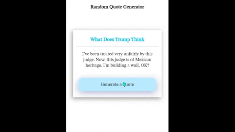

# Random Quote Generator

## Table of contents

- [Overview](#overview)
  - [Screenshot](#screenshot)
  - [Built with](#built-with)
  - [What I learned](#what-i-learned)
  - [Useful resources](#useful-resources)
- [Author](#author)

## Overview
- This projects is about to create a radom quote generator using an API - [What Does Trump Think
](https://whatdoestrumpthink.com/api-docs/index.html?javascript#introduction)

### Screenshot

### Built with
 - HTML
 - CSS
 - JavaScript 

### What I learned
 - While creating this projects I learnt the way to fetch data from an API using JavaScript.

### Useful resources
- [Glassmorphism Effect](https://glassmorphism.com/) - This helped me to create glassmorphism effect using the sliders.
- [Box Shadow Generator](https://cssgenerator.org/box-shadow-css-generator.html) - this helped me to create shadow with ease having Live Demo of the result.

## Author

- Website - [Varun Grover](https://thevarungrovers.vercel.app/)
- GitHub - [@thevarungrovers](https://www.github.com/thevarungrovers)
- Codepen - [@thevarungrovers](https://www.codepen.io/thevarungrovers)

## Acknowledgments
 - Created with the help of [https://freshman.tech/random-quote-machine/](https://freshman.tech/random-quote-machine/)

